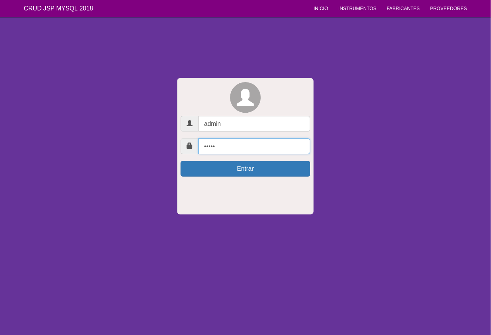

# CRUD_II_JSP_2018 (V2)

Este ejercicio en JSP y MySQL será sobre una tienda de música (Guitarras, Bajos y Baterías).  


## Descripción

He usado el framework CSS Bootstrap que ha dado estilo a la web basada en JSP y base de datos en MySQL.
He decidido hacerlo sobre música porque es lo que más me gusta.  


## Páginas

Aquí dejo capturas de pantalla de las diferentes páginas de la web.  


### Inicio


Decidí usar unos colores estilo Material Design.  


### Instrumentos

  


### Fabricantes

  


### Proveedores

  


## Funcionalidades

```
Ahora vamos a ver las funcionalidades
```


### Editar / Actualizar

  


### Borrar / Añadir / Mostrar

  

  


# NUEVO

## INICIO DE SESIÓN CON HASH MAP

### Captura de pantalla



### Código JSP/HTML

```
<%

HashMap<String, String> acceso = new HashMap<String, String>();
    
	acceso.put("admin", "admin");
  acceso.put("malaga27", "codigopostal");
  acceso.put("usuario", "usuario");
  acceso.put("gonzalo", "chaparro");
  
  String usuario = request.getParameter("usuario");
  String contrasena = request.getParameter("contrasena");
  
  if (acceso.containsKey(usuario)) {
    if (acceso.get(usuario).equals(contrasena)) {
      session.setAttribute("usuario", usuario);
      response.sendRedirect("home.jsp");
      
    } else {
      out.println("<div class='alert alert-success' role='alert'>Contraseña incorrecta</div>");
      out.println("<a href='index.jsp' class='btn btn-primary'><span class='glyphicon glyphicon-home'></span>Volver a iniciar sesión</button></a>");
    }

  } else {
    out.println("<div class='alert alert-success' role='alert'>El usuario no existe</div>");
    out.println("<a href='index.jsp' class='btn btn-primary'><span class='glyphicon glyphicon-home'></span>Volver a iniciar sesión</button></a>");
  }

%>
```

## LOS TIPOS DE INSTRUMENTOS ESTÁN GUARDADOS EN UN ARRAYLIST

### Código JSP/HTML

```
...
<%
  ArrayList<String> instrumento = new ArrayList();
  instrumento.add("Guitarra Eléctrica");
  instrumento.add("Guitarra Acústica");
  instrumento.add("Guitarra Española");
  instrumento.add("Bajo Eléctrico");
  instrumento.add("Bajo Acústico");
  instrumento.add("Batería Acústica");
  instrumento.add("Batería Eléctrica");
%>

<div class="form-group">
	<select type="text" class="form-control select-instrumentos" name="instrumento">
  <option value="" selected disabled hidden>Elige el instrumento</option>

  <%
  for (String x : instrumento) {
    out.println("<option>" + x + "</option>");
  }
  %>
	</select>
<div>
...
```